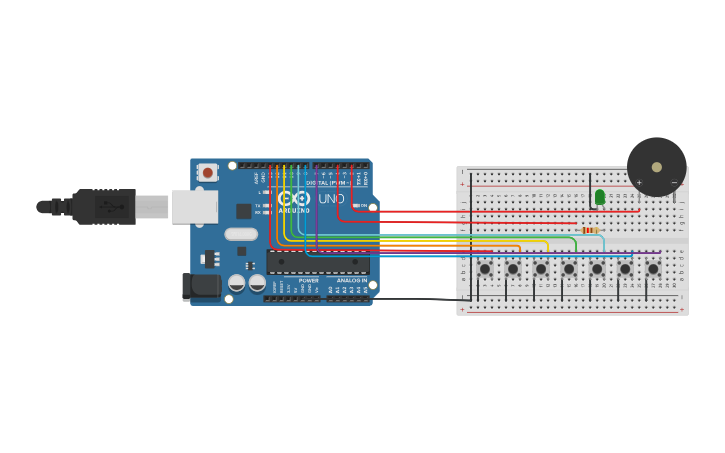

# 🎹 Mini Piano com Arduino

Este projeto simula um mini piano utilizando o Arduino UNO. Ao pressionar diferentes botões, são emitidos sons correspondentes a notas musicais, e um LED acende indicando que uma nota está sendo tocada.

## 🔧 Componentes Utilizados

- Arduino UNO R3
- Placa de Ensaio Pequena (Breadboard)
- Buzzer (Piezoelétrico)
- LED Verde
- Resistor de 120 Ohms
- 7 Botões
- Jumpers

## 🔌 Esquema do Circuito

> O buzzer está conectado ao pino digital 2, o LED ao pino 4 e os botões aos pinos digitais de 7 a 13.

## 💻 Código

O código está disponível no arquivo [`mini_piano.ino`](./mini_piano.ino).  
Ele está comentado em **português e inglês** para facilitar o entendimento.

### Funcionalidade:
- Cada botão toca uma frequência sonora diferente.
- O LED acende enquanto uma nota está sendo tocada.
- As entradas dos botões utilizam o modo `INPUT_PULLUP`.

## 🚀 Como Usar

1. Monte o circuito conforme o esquema acima.
2. Abra o arquivo `.ino` na [IDE do Arduino](https://www.arduino.cc/en/software).
3. Conecte sua placa Arduino e envie o código.
4. Pressione os botões para ouvir as notas musicais!

## 👤 Autor

Guilherme Muniz Monteiro  
Projeto desenvolvido com o Tinkercad e Arduino UNO como prática de aprendizado.

---

